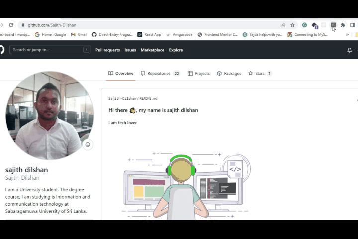

Chrome Extension to show the latest data on covid-19 of Sri Lanka.
======

This browser extension displays the latest data on Coronavirus (COVID-19) in the Sri Lanka. Here, ``https://www.hpb.health.gov.lk/api/get-current-statistical`` API in order to fetch data to get this data.I will only display the latest report for simplicity of this extension.

For more information, visit the API Documentation at the Health Promotion Bureau
https://www.hpb.health.gov.lk/en/api-documentation

### How to use this repo?

1. Clone the repository first  'git clone'

``https://github.com/Sajith-Dilshan/Browser-extension-for-covid-data-in-sri-lanka.git``

2. Once cloned,Go to browser and Select More Tools and then choose Extensions from the browser menu.

3. After choosing Extensions, it redirects to the extensions page in browser. Make sure to enable the Developer mode here.

4. Click the Load unpacked button which will allow us to load our project.

5. Now, the extension is available in our extension store. You can also pin the extension in the browser as shown in the gif above.

# Tools used #
* HTML, CSS and JavaScript
* [Bootstrap 5](https://getbootstrap.com/docs/5.0/getting-started/introduction/)

### LICENSE
Copyright © 2022 Sajith dilshan. All Rights Reserved.
This project is licensed under[MIT](LICENSE.txt) license.